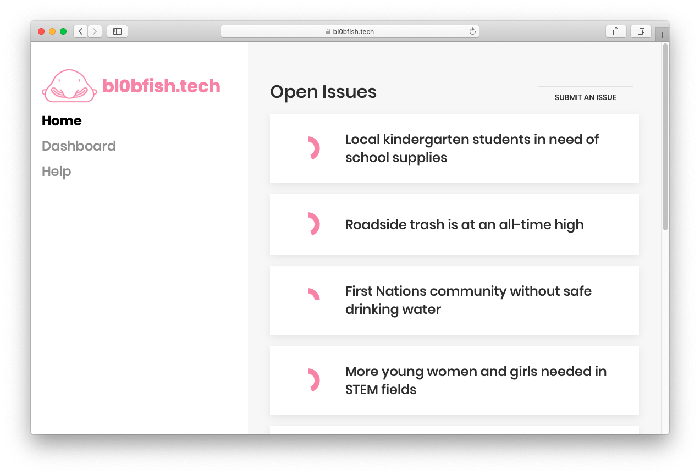

# bl0bfish

Blobfish is an issue-tracking platform (similar to Jira), but instead of tracking *code* issues, Blobfish tracks *social* issues.

This project won *Best Social Impact Hack* at [Hack Western 5](https://hackwestern.com/) in October 2018 (Sponsored by [Magnet Forensics](https://www.magnetforensics.com/)).

## Tech Stack

Frontend: Vue.js, [UIKit](https://getuikit.com/docs/introduction)

Backend: Functions hosted on [Standard Library](https://stdlib.com/), written in FaaSlang (similar to Node.js).

## License
MIT